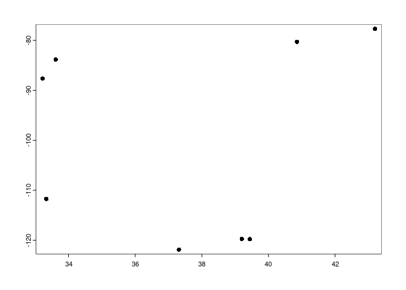

# Team Zero E-Mission’s FIRE Summit Presentation
Sohum Belhe, Aadit Shah, Aidan Vu

## Research Question

What is the impact of opening electric vehicle (EV) battery recycling
plants on PM2.5 pollution levels in surrounding areas?


## Data Wrangling

**Outcome variable**

Our outcome variable is air quality before and after opening an electric
vehicle battery recycling plant. Specifically, we examine the amount of
NO2 emissions in surrounding areas.

Our data comes from the NASA NOx emissions database. The dataset obtained from NASA Earth Data for our research is namely : 
OMI/Aura NO2 Tropospheric, Stratospheric & Total Columns MINDS Daily L2 Global Gridded 0.25 degree x 0.25 degree V1.1 (OMI_MINDS_NO2G) at GES DISC.
This dataset contains daily global measurements of nitrogen dioxide (NO2) in the Earth's atmosphere. The data is gridded at a resolution of 0.25 degrees 
latitude by 0.25 degrees longitude and is available from 2004 to present. In our research, we exclusively utilized data specific to the United States, 
employing the filtering options available on the website.

In the code below, we combined our own research of EV battery recycling
plant data, and queried the data from the NASA database. We processed
this data, extracted it, and compiled it in a dataframe.

``` r
library("tidyverse")
library("terra")
library("raster")

factories<-read.csv("Factory Data.csv")
factory_plot <- vect(factories,geom=c("Longitude", "Latitude"))
bf<-buffer(factory_plot, width=10000)

# starting index
i<-2 

df3<-c()
for (i in 2:501) {
  print(i)
  n<-nc_open(paste0(path, f[i]))  
  r<-brick(paste0(path, f[i]), varname="ColumnAmountNO2")
  sr <- as(r, "SpatRaster")
  rp<-project(sr, "+proj=longlat +ellps=WGS84 +datum=WGS84 +no_defs ")
  
  df<-extract(rp, bf, fun="mean")
  
  df2<-data.frame(df, filename=f[i])
  
  names(df2)<-c("ID", "NO2", "Filename")
  
  df3<-rbind(df3,df2)
}
```

**Treatment variable**

| Company                             | Location               | Latitude    | Longitude    | Opening Year | Opening Month | Process         |
|-------------------------------------|------------------------|-------------|--------------|--------------|---------------|-----------------|
| Li-Cycle Holdings Corp.             | "Rochester, New York"  | 43.19823767 | -77.67825568 | 2022         |               | Hydrometallurgy |
| Li-Cycle Holdings Corp.             | "Gilbert, Arizona"     | 33.33090907 | -111.7293214 | 2022         | May           | Hydrometallurgy |
| Li-Cycle Holdings Corp.             | "Tuscaloosa, Alabama"  | 33.22030374 | -87.64053777 | 2022         | October       | Hydrometallurgy |
| Redwood Materials                   | "Carson City, Nevada"  | 39.20098488 | -119.7371803 |              |               | Hydrometallurgy |
| American Battery Technology Company | "Reno, Nevada"         | 39.44152083 | -119.7641779 | 2023         |               | Hydrometallurgy |
| Glencore Recycling                  | "San Jose, California" | 37.31085584 | -121.8696997 |              |               |                 |
| Ascend Elements                     | "Covington, Georgia "  | 33.61454146 | -83.83656686 | 2023         | March         | Hydrometallurgy |
| Inmetco                             | "Elwood, Pennsylvania" | 40.85721477 | -80.27311203 |              |               | Pyrometallurgy  |


Our treatment variable is the opening of the lithium ion battery
recycling plants. We mapped the data, collecting the longitude,
latitude, and opening dates from separate factories chosen from the table shown above, our map is shown
below.

``` r
install.packages("tidyverse")
library("tidyverse")
install.packages("raster")
library("raster")
install.packages("simplermarkdown")
library("simplermarkdown")
install.packages("terra")
library("terra")
install.packages("tidyterra")
library("tidyterra")
factories<-read.csv("Factory Data.csv")
factory_plot <- vect(factories,geom=c("Latitude", "Longitude"))
s <- vect("state/cb_2018_us_state_20m.shp")
crs(factory_plot) <- crs(s)
plot(factory_plot)
plot(s, add = TRUE)
```



Below is our factories mapped on a map of the US.

``` r
factories<-read.csv("Factory Data.csv")
factory_plot <- vect(factories,geom=c("Longitude", "Latitude"))
s <- vect("state/cb_2018_us_state_20m.shp")
#f<-project(factory_plot, "+proj=longlat +ellps=WGS84 +datum=WGS84")
crs(factory_plot) <- crs(s)
plot(factory_plot)
plot(s, add = TRUE)
```


## Preliminary Results

Display a figure showing how the treatment variable impacted the outcome
variable.

``` r
df<-read.csv("nasa_no2.csv")

open1<-as.Date("20220101", format='%Y%m%d')
open2<-as.Date("20220501", format='%Y%m%d')
open3<-as.Date("20221001", format='%Y%m%d')

df2<-df %>%
  filter(!is.na(NO2)) %>%
  filter(ID<=3) %>%
  mutate(date=paste0(substr(Filename,6,9), substr(Filename, 11,14))) %>%
  mutate(date=as.Date(date, format='%Y%m%d')) %>%
  mutate(PrePost=ifelse(ID==1 & date<open1, "Before", "After")) %>%
  mutate(PrePost=ifelse(ID==2 & date<open2, "Before", PrePost)) %>%
  mutate(PrePost=ifelse(ID==3 & date<open3, "Before", PrePost))

ggplot(data=df2, aes(x=date, y=NO2, color=PrePost, shape=factor(ID)))+
  geom_point()+
  theme_bw()+
  xlab("Year")+
  ylab("Total Column Troposheric NO2")+
  labs(shape = "Factory ID", colour = "Opening Status")
```


